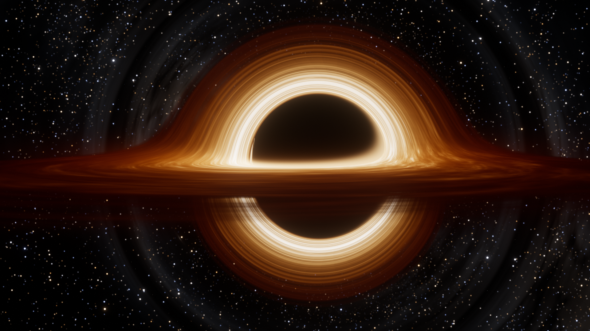
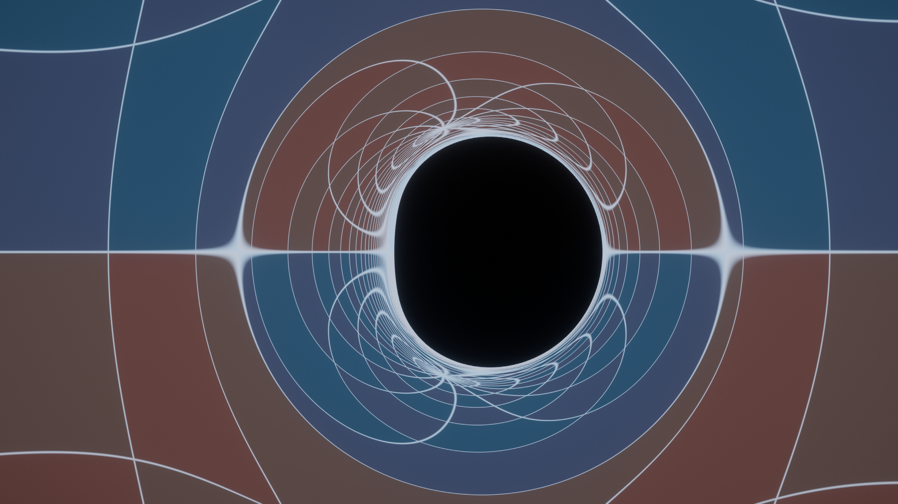
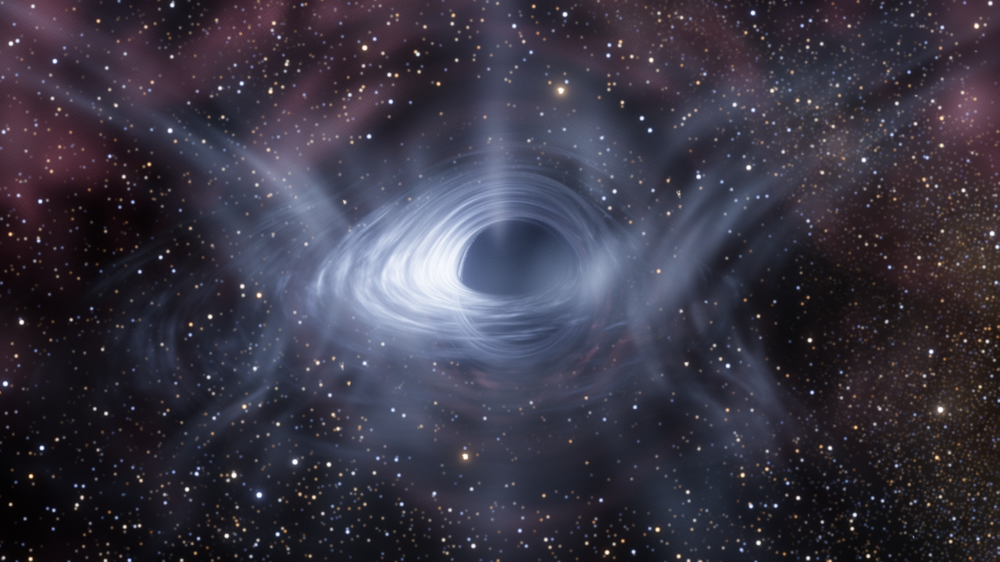

# Kerr Black Hole

[](https://doi.org/10.5281/zenodo.23139593)

A real-time general-relativistic ray tracer for a rotating (Kerr) black hole, running entirely in the browser on WebGL2. No build step, no dependencies, no external assets: the sky, the stars, the Milky Way and the accretion-disk texture are all generated in code.

**[Live demo](https://pandakingpunc.github.io/kerr-black-hole/)** · English · [Türkçe](README.tr.md)


## Features

- **True geodesic ray tracing.** Every pixel traces a light ray backwards from the camera through curved spacetime. Geodesics are integrated in Kerr-Schild coordinates in Hamiltonian form, with analytic derivatives and an adaptive-step 4th-order Runge-Kutta integrator, on the GPU.
- **Physically motivated accretion disk.** Novikov-Thorne (Page-Thorne) thin-disk temperature profile with the inner edge at the ISCO, Kerr Keplerian rotation, Doppler beaming, gravitational redshift, blackbody colors and light-travel-time delay.
- **Shadow, photon ring and lensing.** The D-shaped shadow of a spinning hole, the photon ring and higher-order images, Einstein rings, and a lens-map mode that draws a coordinate grid on the sky.
- **Fall into the black hole.** The camera follows a real timelike geodesic across the event horizon, with proper time and speed readouts. A rotating hole stops at the inner (Cauchy) horizon, a non-rotating one at the singularity.
- **EHT view.** Renders the same physics at 1.3 mm VLBI resolution, comparable to the 2019 M87* image.
- **TON 618 quasar mode.** Switch with the *Kerr / TON 618* toggle at the top left (or `Q`) to one of the most massive black holes known: 4.07×10¹⁰ M☉, L ≈ 4×10⁴⁰ W, z = 2.219. The disk temperature follows from mass, spin and luminosity (Page-Thorne flux, about 25,000 K, so the disk is blue-white), and the quasar's surroundings are added: a hot X-ray corona, a funnel-shaped disk wind, a jet, and the broad-line region clouds a few hundred M out, sized by the measured radius-luminosity relation. Switching back restores your previous settings.
- **Relativistic jet**, an *Interstellar*-style thick disk, an equatorial light-path diagram, an auto tour with captions, and 9 preset scenes.
- **Video recording and screenshots.** Record the render to MP4 (or WebM) with `R`, or save a PNG with `S`.
- **English and Turkish interface.** English is the default; switch with the EN/TR toggle (the choice is remembered).

| Interstellar-style disk | Lens map |
| --- | --- |
|  |  |



## Run it

Open `index.html` in a current browser, or serve the folder with any static server:

```bash
python -m http.server 8000
# then open http://localhost:8000
```

Requirements: a browser with **WebGL2** and the `EXT_color_buffer_float` extension (current Chrome, Edge, Firefox or Safari) and a reasonably capable GPU. The renderer scales its resolution automatically to hold about 60 fps; pick a quality level in the *Image* section of the panel.

## Controls

| Input | Action |
| --- | --- |
| Drag | Orbit the black hole |
| Shift + drag | Look around |
| Wheel / pinch | Zoom |
| `C` / `O` | Cinematic / free camera |
| `D` or `Esc` | Fall into the black hole / exit the fall |
| `Q` | Switch between the Kerr black hole and the TON 618 quasar |
| `1`–`9` | Preset scenes |
| `T` | Auto tour |
| `Space` | Pause disk motion |
| `R` | Start / stop video recording |
| `S` | Save a screenshot (PNG) |
| `H` / `P` | Hide the interface / toggle the settings panel |
| `F` | Fullscreen |
| `I` | Explanation card |

Video recording captures only the rendered image, not the interface, and stops by itself after 5 minutes.

### URL parameters

Settings can be preloaded from the address bar, for example `?preset=gargantua`, `?spin=0.99&incl=87&dist=22`, `?object=ton618`, `?lang=tr` or `?ui=0&tour=1`.

- `object`: `kerr` (default) or `ton618`
- `preset`: `fiziksel`, `gargantua`, `kutup`, `kenar`, `yakin`, `lens`, `m87`, `jet`, `ton618`
- any panel setting by name: `spin`, `incl`, `dist`, `fov`, `roll`, `temp`, `rout`, `density`, `exposure`, `quality` (`dusuk`, `orta`, `yuksek`, `ultra`), `mass` (`sgra`, `m87`, `garg`, `stellar`, `ton618`), `edd`, `physT`, `corona`, `wind`, `blr`, …
- `lang` (`en` or `tr`), `mode` (`cinematic` or `orbit`), `tour=1`, `ui=0`, `panel=0`, `diagram=0`

## Validation

The physics core ([`js/physics.js`](js/physics.js)) is plain JavaScript and is tested in Node.js against analytic results:

```bash
node dev/test_physics.js
```

The Schwarzschild shadow angle and the Kerr equatorial critical impact parameters (a = 0, 0.5, 0.9, 0.99) agree to five digits, the ISCO and photon orbits are exact, and free-fall proper time matches the analytic value within 0.01%. The absolute Page-Thorne flux used for the quasar disk temperature conserves energy: the radiated power ∫ 4πr F E dr equals the efficiency 1 − E_ISCO to 10⁻⁵ (a = 0, 0.9, 0.99). Measured on the GPU image: for a = 0 the shadow diameter is 392 px (analytic 393.1), and for a = 0.9 the asymmetric shadow's edges are at 849 px and 1215 px (CPU reference 848.7 and 1216.0).

`dev/cdp.js` is a helper that drives headless Chrome for screenshots and benchmarks; it currently assumes macOS.

## Project layout

```
index.html        page, styles and static text
js/i18n.js        English / Turkish strings
js/physics.js     Kerr-Schild metric, geodesics, ISCO, disk flux and temperature, quasar disk, blackbody table
js/shaders.js     GLSL: sky generator, ray tracer (disk, jet, quasar corona, wind, BLR), TAA, bloom, composite
js/main.js        WebGL2 pipeline, camera, free fall, UI, recording
dev/              numerical tests and tooling
screenshots/      images used in this README
```

## Citation

If you use this software in your work, please cite it. The DOI [10.5281/zenodo.23139593](https://doi.org/10.5281/zenodo.23139593) always resolves to the latest version (Zenodo archive). The metadata is in [`CITATION.cff`](CITATION.cff), and GitHub's **Cite this repository** button (right sidebar) exports BibTeX and APA.

## License

[MIT](LICENSE)
