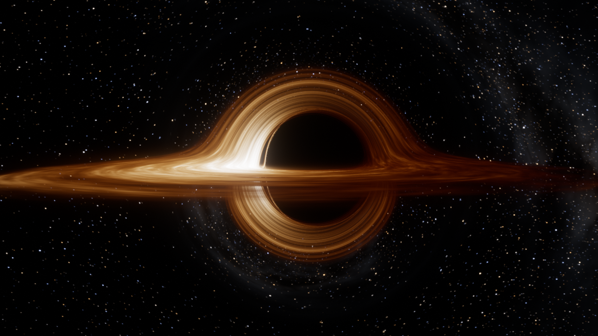

# Kerr Kara Deliği

Dönen (Kerr) bir kara deliğin tarayıcıda, WebGL2 ile çalışan gerçek zamanlı genel görelilik ışın izleyicisi. Derleme adımı, bağımlılık ve dış dosya yok: gökyüzü, yıldızlar, Samanyolu ve yığılma diski dokusu tamamen kodla üretilir.

[English](README.md) · Türkçe



## Özellikler

- **Gerçek jeodezik ışın izleme.** Her piksel için ışık, kameradan geriye doğru eğri uzay-zamanda izlenir. Denklemler Kerr-Schild koordinatlarında Hamilton biçiminde, analitik türevlerle ve uyarlanır adımlı 4. derece Runge-Kutta ile GPU'da çözülür.
- **Fiziksel yığılma diski.** Novikov-Thorne (Page-Thorne) sıcaklık profili, ISCO'da iç kenar, Doppler ışıması, kütleçekimsel kırmızıya kayma, kara cisim renkleri ve ışığın yol süresi.
- **Gölge, foton halkası ve mercekleme.** Hızlı dönen deliğin D biçimli gölgesi, Einstein halkası ve gökyüzüne ızgara çizen lens haritası.
- **Kara deliğe düşüş.** Kamera olay ufkunu geçen gerçek bir zamansı jeodezik izler.
- **EHT gözüyle:** 1,3 mm VLBI çözünürlüğünde M87* benzeri görüntü.
- **Göreli jet**, Interstellar tarzı kalın disk, ışık yolları diyagramı, açıklamalı otomatik tur ve 8 hazır sahne.
- **Video kaydı ve ekran görüntüsü:** `R` ile MP4 (veya WebM) kaydı, `S` ile PNG.
- **İngilizce ve Türkçe arayüz.** Varsayılan İngilizcedir; sol üstteki EN/TR düğmesiyle değişir ve seçim hatırlanır (`?lang=tr` ile de açılabilir).

## Çalıştırma

`index.html` dosyasını güncel bir tarayıcıda açın ya da klasörü bir statik sunucuyla sunun:

```bash
python -m http.server 8000
```

**WebGL2** ve `EXT_color_buffer_float` desteği gerekir (güncel Chrome, Edge, Firefox veya Safari). Çözünürlük, yaklaşık 60 fps için otomatik ayarlanır.

Kısayollar, URL parametreleri, doğrulama sonuçları ve proje yapısı için [English README](README.md) bölümlerine bakın.

## Lisans

[MIT](LICENSE)
